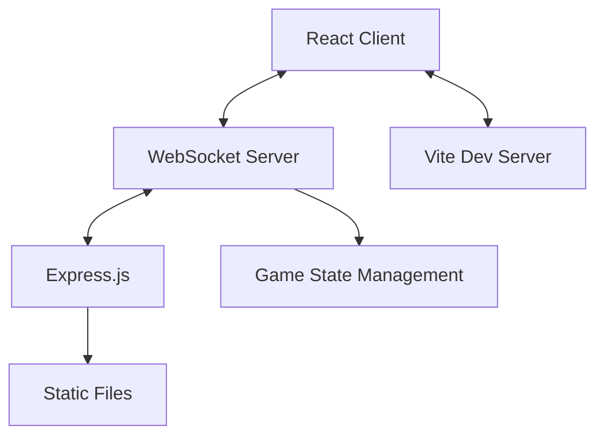

# Tech Hub トークカード - 技術学習ガイド

## 🎯 学習目標

このプロジェクトを通じて以下の技術を実践的に学習できます：

- **TypeScript**: 型安全なJavaScript開発
- **React**: モダンなフロントエンド開発
- **WebSocket**: リアルタイム通信の実装
- **Node.js/Express**: サーバーサイド開発
- **モダンな開発環境**: Vite, ESModules, etc.

## 🏗️ アーキテクチャ解説

### システム構成図


### ディレクトリ構造
```
techhub-cards/
├── shared/                    # 共通型定義・データ
│   ├── types.ts              # 型定義（サーバー・クライアント共通）
│   └── cards.ts              # カードデータ
├── server/                   # バックエンド
│   ├── index.ts             # WebSocketサーバー + Express
│   └── tsconfig.json        # サーバー用TypeScript設定
├── src/                     # フロントエンド
│   ├── App.tsx              # メインアプリケーション
│   ├── App.css              # グローバルスタイル
│   ├── main.tsx             # React エントリーポイント
│   ├── types.ts             # 型定義（再エクスポート）
│   ├── hooks/               # カスタムHooks
│   │   └── useSocket.ts     # WebSocket接続管理
│   ├── components/          # Reactコンポーネント
│   │   ├── CardDisplay.tsx  # カード表示
│   │   ├── Controls.tsx     # 操作コントロール
│   │   ├── Stats.tsx        # 統計情報
│   │   ├── Message.tsx      # メッセージ表示
│   │   └── AdminPanel.tsx   # 管理者画面
│   └── data/
│       └── cards.ts         # データ（再エクスポート）
└── v1-backup/               # 従来版バックアップ
```

## 💻 TypeScript 学習ポイント

### 1. 型定義の設計
```typescript
// shared/types.ts
export interface Card {
  id: number
  title: string
  description: string
  category: string
  difficulty: 'initial' | 'intermediate' | 'advanced' // Union Types
}

export interface GameState {
  availableCards: Card[]     // 配列型
  usedCards: Card[]
  currentCard: Card | null   // Union with null
  isDrawing: boolean
  participants: number
}
```

**学習ポイント**:
- **Interface**: オブジェクトの形状を定義
- **Union Types**: `|` で複数の型を組み合わせ
- **Array Types**: `Type[]` で配列を表現
- **Optional**: `?` で省略可能プロパティ

### 2. ジェネリクス活用
```typescript
// WebSocket通信の型定義
export interface SocketEvents {
  'card:draw': (filters?: { category?: string; difficulty?: string }) => void
  'card:drawn': (data: { card: Card; gameState: GameState }) => void
  'participants:update': (count: number) => void
}
```

**学習ポイント**:
- **Event Mapping**: イベント名と引数の型を対応付け
- **Optional Parameters**: `?` で省略可能引数
- **Return Type**: `void` で戻り値なし関数

### 3. 型ガード・型推論
```typescript
// useSocket.ts内
const drawCard = (filters?: { category?: string; difficulty?: string }) => {
  if (socket && !gameState.isDrawing) {  // 型ガード
    socket.emit('card:draw', filters)
  }
}
```

**学習ポイント**:
- **Conditional Checks**: 実行時型チェック
- **Type Inference**: TypeScriptが型を自動推論

## ⚛️ React 学習ポイント

### 1. カスタムHooks
```typescript
// src/hooks/useSocket.ts
export const useSocket = () => {
  const [socket, setSocket] = useState<Socket | null>(null)
  const [gameState, setGameState] = useState<GameState>({
    availableCards: [],
    usedCards: [],
    currentCard: null,
    isDrawing: false,
    participants: 0
  })

  useEffect(() => {
    const newSocket = io(window.location.origin)
    // ... WebSocket設定
    setSocket(newSocket)
    
    return () => {
      newSocket.close()  // クリーンアップ
    }
  }, [])

  return {
    gameState,
    drawCard,
    resetGame,
    isConnected: socket?.connected || false
  }
}
```

**学習ポイント**:
- **Custom Hooks**: ロジックの再利用
- **useState**: 状態管理
- **useEffect**: 副作用処理
- **Cleanup**: メモリリーク防止

### 2. 条件付きレンダリング
```typescript
// src/components/CardDisplay.tsx
export const CardDisplay = ({ gameState, categories, difficulties }) => {
  if (gameState.isDrawing) {
    return <div className="card-animation">...</div>
  }

  if (gameState.currentCard) {
    const card = gameState.currentCard
    return (
      <div className="drawn-card" style={{ borderColor: categoryInfo.color }}>
        {/* カード表示 */}
      </div>
    )
  }

  return <div className="no-card">...</div>
}
```

**学習ポイント**:
- **Early Return**: 条件に応じた早期リターン
- **Dynamic Styling**: 条件付きスタイル適用
- **Component Composition**: コンポーネント分割

### 3. Props型定義
```typescript
interface CardDisplayProps {
  gameState: GameState
  categories: Record<string, CategoryInfo>
  difficulties: Record<string, DifficultyInfo>
}

export const CardDisplay = ({ gameState, categories, difficulties }: CardDisplayProps) => {
  // ...
}
```

**学習ポイント**:
- **Props Interface**: プロパティの型定義
- **Record Type**: オブジェクトの型定義
- **Destructuring**: 分割代入でProps受け取り

## 🌐 WebSocket 学習ポイント

### 1. サーバーサイド実装
```typescript
// server/index.ts
import { Server } from 'socket.io'

const io = new Server<SocketEvents, SocketEvents>(server, {
  cors: {
    origin: ["http://localhost:5173", "http://localhost:3001"],
    methods: ["GET", "POST"]
  }
})

io.on('connection', (socket) => {
  console.log('Client connected:', socket.id)
  
  // 現在の状態を送信
  socket.emit('game:state', gameState)
  
  // イベントハンドラ
  socket.on('card:draw', (filters) => {
    // カード抽選ロジック
    io.emit('card:drawn', { card: drawnCard, gameState })  // 全クライアントに配信
  })
  
  socket.on('disconnect', () => {
    console.log('Client disconnected:', socket.id)
  })
})
```

**学習ポイント**:
- **CORS設定**: クロスオリジン通信の許可
- **Event Handlers**: イベント駆動プログラミング
- **Broadcast**: `io.emit()` で全クライアントに配信
- **Individual**: `socket.emit()` で個別クライアントに送信

### 2. クライアントサイド実装
```typescript
// src/hooks/useSocket.ts
import { io, Socket } from 'socket.io-client'

useEffect(() => {
  const newSocket = io(window.location.origin, {
    transports: ['websocket', 'polling']  // フォールバック設定
  })

  newSocket.on('connect', () => {
    console.log('Connected to server')
    newSocket.emit('game:join')  // 参加通知
  })

  newSocket.on('card:drawn', ({ card, gameState: newGameState }) => {
    setGameState(newGameState)  // 状態更新
  })

  return () => {
    newSocket.close()  // 接続解除
  }
}, [])
```

**学習ポイント**:
- **Transport Options**: WebSocket + HTTP Pollingフォールバック
- **Connection Lifecycle**: 接続・切断イベント
- **State Synchronization**: サーバー状態とクライアント状態の同期

### 3. リアルタイム状態管理
```typescript
// ゲーム状態の管理
let gameState: GameState = {
  availableCards: [...techHubCards],
  usedCards: [],
  currentCard: null,
  isDrawing: false,
  participants: 0
}

// 状態変更時に全クライアントに通知
const updateGameState = () => {
  io.emit('game:state', gameState)
}
```

**学習ポイント**:
- **Centralized State**: サーバーで一元管理
- **State Broadcasting**: 変更を全クライアントに通知
- **Optimistic Updates**: クライアント側での楽観的更新

## 🔧 モダン開発環境

### 1. Vite設定
```typescript
// vite.config.ts
import { defineConfig } from 'vite'
import react from '@vitejs/plugin-react'

export default defineConfig({
  plugins: [react()],
  server: {
    port: 5173,
    proxy: {
      '/api': {
        target: 'http://localhost:3001',
        changeOrigin: true,
      },
      '/socket.io': {
        target: 'http://localhost:3001',
        changeOrigin: true,
        ws: true,  // WebSocket プロキシ
      }
    }
  }
})
```

**学習ポイント**:
- **Dev Server**: 開発用サーバー設定
- **Proxy Configuration**: API・WebSocketのプロキシ
- **Hot Module Replacement**: リアルタイム更新

### 2. ESModules設定
```json
// package.json
{
  "type": "module",  // ESModules有効化
  "scripts": {
    "dev": "concurrently \"npm run server:dev\" \"npm run client:dev\"",
    "server:dev": "tsx watch server/index.ts",
    "client:dev": "vite"
  }
}
```

**学習ポイント**:
- **ES Modules**: `import/export` 構文
- **Concurrent Development**: サーバー・クライアント同時開発
- **Watch Mode**: ファイル変更時の自動再起動

## 🎨 CSS設計パターン

### 1. BEM風命名規則
```css
/* コンポーネント */
.card-container { }
.card-animation { }
.drawn-card { }

/* エレメント */
.card-header { }
.card-title { }
.card-description { }

/* モディファイア */
.status-indicator.connected { }
.message.error { }
```

### 2. CSS Custom Properties
```css
:root {
  --primary-gradient: linear-gradient(135deg, #667eea 0%, #764ba2 100%);
  --success-color: #4CAF50;
  --error-color: #f44336;
}

.btn-primary {
  background: var(--primary-gradient);
}
```

### 3. レスポンシブデザイン
```css
/* Mobile First */
.admin-grid {
  display: grid;
  grid-template-columns: 1fr;
  gap: 20px;
}

/* タブレット以上 */
@media (min-width: 768px) {
  .admin-grid {
    grid-template-columns: 1fr 1fr;
    gap: 30px;
  }
}
```

## 🚀 パフォーマンス最適化

### 1. メモ化
```typescript
// React.memo でコンポーネントメモ化
export const CardDisplay = React.memo(({ gameState, categories, difficulties }) => {
  // ...
})

// useMemo で値のメモ化
const filteredCards = useMemo(() => {
  return gameState.availableCards.filter(card => {
    return categoryFilter === 'all' || card.category === categoryFilter
  })
}, [gameState.availableCards, categoryFilter])
```

### 2. 遅延読み込み
```typescript
// React.lazy でコード分割
const AdminPanel = React.lazy(() => import('./components/AdminPanel'))

function App() {
  return (
    <Suspense fallback={<div>Loading...</div>}>
      <AdminPanel />
    </Suspense>
  )
}
```

### 3. WebSocket最適化
```typescript
// デバウンス処理
const debouncedEmit = useMemo(
  () => debounce((event, data) => {
    socket?.emit(event, data)
  }, 300),
  [socket]
)
```

## 📖 学習リソース

### TypeScript
- [TypeScript公式ハンドブック](https://www.typescriptlang.org/docs/)
- [TypeScript Deep Dive](https://basarat.gitbook.io/typescript/)

### React
- [React公式ドキュメント](https://react.dev/)
- [React Hooks完全ガイド](https://overreacted.io/a-complete-guide-to-useeffect/)

### WebSocket
- [Socket.IO公式ドキュメント](https://socket.io/docs/v4/)
- [WebSocketの基礎](https://developer.mozilla.org/en-US/docs/Web/API/WebSockets_API)

### Node.js/Express
- [Node.js公式ガイド](https://nodejs.org/en/docs/guides/)
- [Express.js公式ドキュメント](https://expressjs.com/)

## 🛠️ 拡張アイデア

### 機能拡張
- **投票機能**: トーク後の評価システム
- **チーム戦**: グループ対抗戦モード
- **時間管理**: 自動タイマー機能
- **統計**: 使用頻度の分析

### 技術的改善
- **認証**: ユーザー管理機能
- **データベース**: 永続化ストレージ
- **PWA**: オフライン対応
- **Docker**: コンテナ化

これらの学習ポイントを参考に、モダンなWeb開発技術を体系的に習得してください！